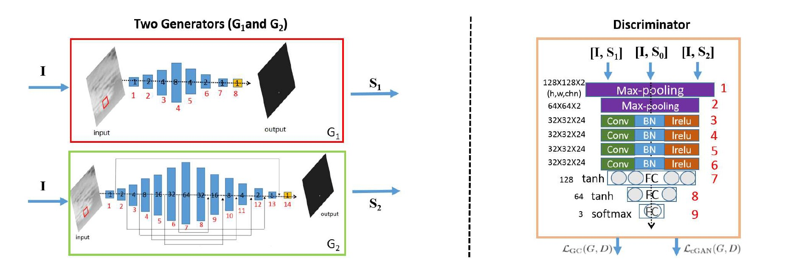
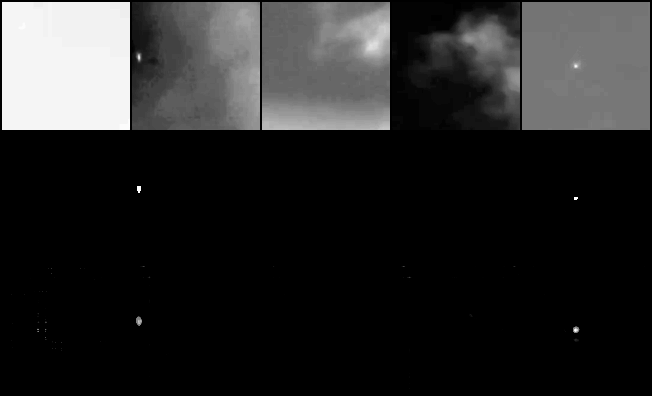
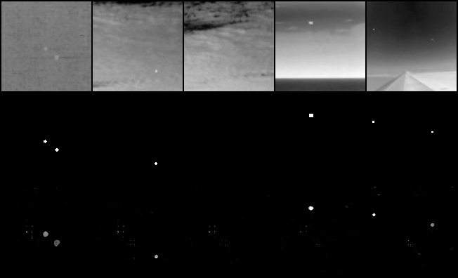

# MDvsFAcGAN
> 2022 Spring HUST AIA
>
> 视觉认知工程

Paper: https://openaccess.thecvf.com/content_ICCV_2019/html/Wang_Miss_Detection_vs._False_Alarm_Adversarial_Learning_for_Small_Object_ICCV_2019_paper.html

## Datasets

- **Train:** 
  - MDvsFA: 10000 images
- **Test:** 
  - MDvsFA: 100 images
  - Sirst: 427 images

## Model

- $G_1$: Minimize Miss Detection
- $G_2$: Minimize False Alarm

## Experimental Setup

- $epoch=30$

- $batch size = 10$

- $\lambda_1 =100, \lambda_2 = 10$

- $\alpha_1 = 100, \alpha_2 = 10$

- $optimizer: Adam$

  - $\beta_1 = 0.5$
  - $\beta_2 = 0.999$
  - $lr_{init} = 1e-4$

## Result

### F1 Score

| MDvsFA_test | Sirst  |
| :---------: | :----: |
|   0.5557    | 0.5519 |

### image

- MDvsFA

- Sirst

The first row is the original image, the second row is the ground truth and the third row is the model output.

More image can be found in `./eval_image`

